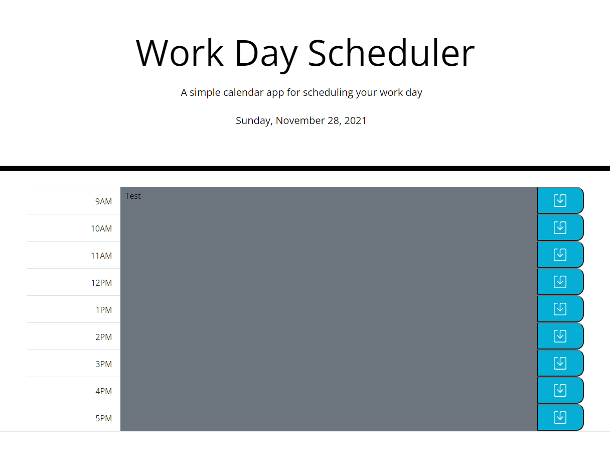

# Work Day Scheduler

## Description

This challenge taught me a few things. I learned that Moment.js does not work well with some browsers currently so I was able to convert my functions to Day.js and get that to work. Its very similar and I didn't have to change much to get my main functions to work. Mush easier to work with and the documentation is much easier to read and follow. I was able to use both Bootstrap and the custom css included in the starter files.

## Installation

Follow the following link to load code into a browser.

[Work Day Scheduler](https://johndavis92790.github.io/work-day-scheduler/)

## Usage

Here is a screenshot of the finished webpage:

